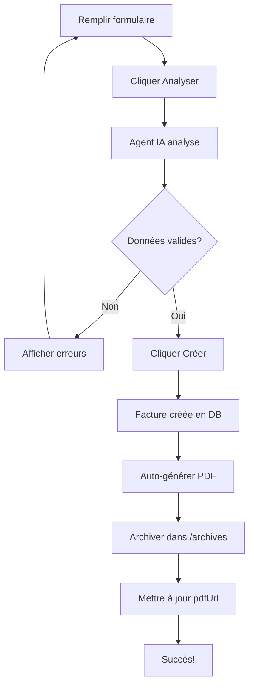

# 🤖 Système d'Agent IA pour Facturation Automatique

## Vue d'ensemble

Ce système automatise la création et la gestion des factures professionnelles en PDF. Il combine :

- **Analyse IA intelligente** des données de formulaire
- **Génération automatique de PDFs** professionnels
- **Archivage centralisé** avec suivi
- **Validation intelligente** avec scores de confiance

---

## 🏗️ Architecture

### Backend (Node.js/Express)

#### **1. Service PDF (`pdf-generator.js`)**
- Génère des factures PDF professionnelles avec pdfkit
- Architecture :
  ```
  PDF Header: Informations entreprise + numéro facture
  Client Info: Nom et adresse de facturation
  Line Items: Tableau détaillé avec description, quantité, prix
  Totals: Montants HT, TVA, TTC
  Footer: Mentions légales
  ```
- Archivage automatique dans `/archives/factures/`
- Format de filename: `FAC-XXXX_timestamp.pdf`

#### **2. Agent IA (`ai-analyzer.js`)**
Classe `FacturationAIAnalyzer` avec :

**Validation des données:**
- ✅ Nom client: 2-100 caractères, alphanumériques
- ✅ Montant: 0.01€ - 999,999.99€
- ✅ Date échéance: Validation et correction automatique
- ✅ TVA: 0-100%

**Corrections automatiques:**
- Nettoyage des espacements
- Capitalisation appropriée
- Suppression des symboles de devises
- Correction des dates invalides

**Score de confiance:** 0-100%
- Basé sur le nombre d'erreurs et avertissements
- Formule: `confidence = 100 - (erreurs × 30) - (avertissements × 10)`

#### **3. Endpoints Backend**

| Endpoint | Méthode | Description |
|----------|---------|-------------|
| `/facturation/analyze` | POST | Analyse les données du formulaire avec IA |
| `/facturation/:id/generate-pdf` | POST | Génère le PDF pour une facture |
| `/facturation/:id/download-pdf` | GET | Télécharge le PDF (blob) |
| `/facturation/:id/validate` | POST | Valide complètement et enregistre l'analyse |
| `/facturation/pdfs/list` | GET | Liste tous les PDFs archivés |

### Frontend (React)

#### **Composant Facturation.jsx amélioré**

**États principaux:**
```javascript
- form: Données du formulaire
- analysisResult: Résultat de l'analyse IA
- archivedPDFs: Liste des PDFs archivés
- isGeneratingPDF: État de génération du PDF
```

**Flux utilisateur:**
1. Remplir le formulaire
2. Cliquer "🔍 Analyser les données"
3. Vérifier le score de confiance et les erreurs
4. Corriger si nécessaire
5. Cliquer "✅ Créer facture & PDF"
6. PDF généré automatiquement
7. Télécharger depuis "📦 PDFs Archivés"

#### **API Services (`api.js`)**
```javascript
- analyzeFactureData(data)      // POST /facturation/analyze
- generateFacturePDF(id)        // POST /facturation/:id/generate-pdf
- downloadFacturePDF(id)        // GET /facturation/:id/download-pdf
- validateFacture(id)           // POST /facturation/:id/validate
- listArchivedPDFs()            // GET /facturation/pdfs/list
```

---

## 💾 Schema MongoDB (Mise à jour)

```javascript
{
  reference: String,              // FAC-0001
  missionId: String,              // Lien vers mission
  clientNom: String,              // Nom client
  clientAdresse: String,          // Adresse facturation
  montant: Number,                // Montant HT
  tva: Number,                    // Pourcentage TVA
  statut: Enum,                   // en_attente | envoyee | payee | en_retard | annulee
  dateEcheance: Date,             // Date limite paiement
  datePaiement: Date,             // Date réelle paiement
  notes: String,                  // Notes
  relances: Array,                // Historique relances
  
  // NOUVEAU: Champs PDF
  pdfFilename: String,            // Nom fichier: FAC-0001_timestamp.pdf
  pdfUrl: String,                 // URL téléchargement: /factures/FAC-0001_timestamp.pdf
  
  // NOUVEAU: Lignes de facturation détaillées
  lignes: [{
    description: String,
    quantite: Number,
    prixUnitaire: Number
  }],
  
  // NOUVEAU: Résultat analyse IA
  analysisResult: {
    confidence: Number,           // 0-100%
    errors: [String],             // Liste erreurs détectées
    warnings: [String],           // Liste avertissements
    timestamp: Date               // Quand l'analyse a eu lieu
  },
  
  createdAt: Date,
  updatedAt: Date
}
```

---

## 🚀 Processus Complet

### Créer une facture avec PDF automatique



### Flux depuis Livraison

```
Livraison marquée livrée
    ↓
Bouton "🧾 Créer facture & PDF"
    ↓
Facture créée avec infos mission
    ↓
PDF généré automatiquement
    ↓
Disponible pour téléchargement
```

---

## 📊 Exemple d'Analyse IA

**Entrée:**
```json
{
  "clientNom": "  ACME corp  ",
  "montant": "€150,00",
  "dateEcheance": "2024-01-01"
}
```

**Processus:**
1. Auto-correction:
   - `"  ACME corp  "` → `"Acme Corp"`
   - `"€150,00"` → `150.00`
   - Date dans le passé → Correction + 30 jours

2. Validation:
   - Tous les champs OK
   - Score confiance: 85% (1 avertissement)

**Résultat:**
```json
{
  "isValid": true,
  "confidence": 85,
  "errors": [],
  "warnings": ["Date d'échéance était passée, corrigée à 30 jours"],
  "cleanData": {
    "clientNom": "Acme Corp",
    "montant": 150.00,
    "dateEcheance": "2024-02-01",
    "tva": 20
  }
}
```

---

## 📦 Archivage PDF

**Structure:**
```
/archives/
  /factures/
    FAC-0001_1715000000000.pdf
    FAC-0002_1715001000000.pdf
    FAC-0003_1715002000000.pdf
    ...
```

**Accès:**
- Via API: `GET /facturation/:id/download-pdf`
- Via URL statique: `GET /factures/FAC-XXXX_timestamp.pdf`
- Liste via: `GET /facturation/pdfs/list`

---

## 🔧 Installation & Configuration

### Backend

```bash
cd services/facturation
npm install

# Dépendances ajoutées:
# - pdfkit: Génération PDF
# - dotenv: Variables environnement
# - axios: Requêtes HTTP
```

### Variables d'environnement
```env
MONGO_URL=mongodb://mongo:27017/erp
PORT=3004
```

### Frontend
```bash
cd frontend

# Dépendances déjà présentes:
# - axios: Pour requêtes API
# - React: UI
```

---

## 💡 Cas d'usage

### 1. Génération automatique depuis mission
```
Chauffeur: "Livraison effectuée"
Système: Clic bouton "Créer facture & PDF"
Résultat: Facture + PDF créés en 1-2 secondes
```

### 2. Création manuelle avec validation
```
Comptable: Remplit formulaire
Système: "🔍 Analyser les données"
Résultat: Affiche erreurs si présentes
Comptable: Corrige + "✅ Créer"
Résultat: Facture + PDF créés
```

### 3. Suivi des factures impayées
```
Système: Affiche factures "en_retard"
Utilisateur: Clic "📨 Relance"
Système: Envoie relance + change statut
Résultat: Tracking automatique
```

### 4. Archive et conformité
```
Toutes les factures: PDFs archivés automatiquement
Recherche factures: Via "📦 PDFs Archivés Récents"
Téléchargement: "📥 Télécharger" pour chaque PDF
Historique: Conservé indéfiniment
```

---

## 🧪 Tests

### Test API Analyse

```bash
curl -X POST http://localhost:3000/facturation/analyze \
  -H "Content-Type: application/json" \
  -d '{
    "clientNom": "ACME",
    "montant": 150,
    "dateEcheance": "2025-12-31",
    "tva": 20
  }'
```

**Réponse attendue:**
```json
{
  "isValid": true,
  "confidence": 100,
  "errors": [],
  "warnings": [],
  "cleanData": {...}
}
```

### Test Génération PDF

```bash
curl -X POST http://localhost:3000/facturation/[ID]/generate-pdf
```

**Vérifier:**
- Fichier créé dans `/archives/factures/`
- Réponse contient `filename` et `pdfUrl`
- Téléchargement fonctionnel

---

## 🐛 Troubleshooting

| Problème | Solution |
|----------|----------|
| PDF non généré | Vérifier `/archives` permissions, relancer |
| Analyse toujours invalide | Vérifier format montant (nombre décimal) |
| Téléchargement échoue | Vérifier path complet du fichier |
| Date échéance corrigée | Comportement normal si date < aujourd'hui |

---

## 📈 Améliorations futures

- [ ] Intégration avec API de paiement
- [ ] Envoi PDF par email automatique
- [ ] Signatures numériques
- [ ] Multi-devises
- [ ] Export en XML/EDI
- [ ] OCR pour extraction données depuis images
- [ ] Factures récurrentes automatiques
- [ ] Webhooks pour événements facturation

---

## 📝 Notes de développement

- **Framework PDF:** pdfkit (Node.js natif)
- **Storage:** Filesystem (peut être migré vers S3/Cloud)
- **Validation:** Côté backend (securité) + côté frontend (UX)
- **Score de confiance:** Heuristique basée sur règles (peut être amélioré avec ML)
- **Archivage:** Automatique lors de génération PDF

---

**Dernier update:** 2026-06-10
**Version:** 1.0 - Production Ready ✅
